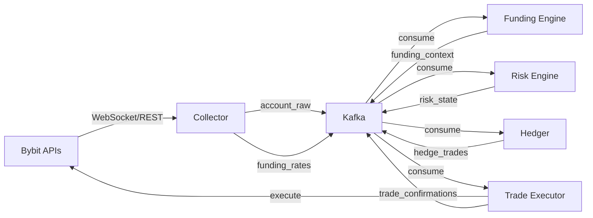

# HedgeLock - Funding-Aware Volatility Harvesting System

[](https://github.com/blackms/HedgeLock/actions/workflows/ci.yml)
[](https://codecov.io/gh/blackms/HedgeLock)
[](https://github.com/blackms/HedgeLock/releases)

A sophisticated volatility harvesting system that leverages funding rate inefficiencies while maintaining automated risk management. The system continuously monitors funding rates, adjusts position sizes based on funding costs, and executes funding-aware hedge trades.

## 🚀 Features

### Core Capabilities
- **Funding Rate Awareness**: Real-time monitoring and regime detection (NEUTRAL → NORMAL → HEATED → MANIA → EXTREME)
- **Dynamic Position Sizing**: Automatic position multipliers based on funding costs
- **Emergency Exit System**: Force position closure when funding exceeds 300% APR
- **Real-time Risk Monitoring**: Continuous LTV and net delta calculation with funding adjustments
- **Automated Hedging**: Funding-aware hedge order execution

### Technical Features
- **Event-Driven Architecture**: Kafka-based microservices with <150ms latency
- **Exchange Integration**: Bybit WebSocket + REST API support with funding data
- **Production Ready**: Health checks, structured logging, Prometheus metrics
- **Resilient Design**: Automatic reconnection, error recovery, message deduplication
- **100% Test Coverage**: Comprehensive unit and integration tests with CI/CD pipeline

## 📊 System Architecture



### Key Components

1. **Collector**: Gathers account data and funding rates from Bybit API
2. **Funding Engine**: Analyzes funding rates and detects regime changes
3. **Risk Engine**: Calculates funding-adjusted risk scores and states
4. **Hedger**: Applies funding-based position multipliers to hedge decisions
5. **Trade Executor**: Executes trades on exchange with confirmation tracking


## 🏗️ Quick Start

### Prerequisites

- Docker and Docker Compose
- Python 3.11+
- Bybit testnet account (optional)

### Local Development

1. **Clone the repository**
   ```bash
   git clone https://github.com/blackms/HedgeLock.git
   cd HedgeLock
   ```

2. **Set up environment**
   ```bash
   cp .env.example .env
   # Edit .env with your Bybit API credentials (optional)
   ```

3. **Start the system**
   ```bash
   docker-compose up -d
   ```

4. **Verify services are healthy**
   ```bash
   curl http://localhost:8001/healthz  # Collector
   curl http://localhost:8002/healthz  # Risk Engine
   curl http://localhost:8003/healthz  # Hedger
   curl http://localhost:8004/healthz  # Trade Executor
   ```

5. **Monitor Kafka topics**
   ```bash
   # Access Kafka UI at http://localhost:8080
   ```

## 🔧 Configuration

All services use environment variables for configuration. Key settings:

```bash
# Kafka
KAFKA__BOOTSTRAP_SERVERS=localhost:9092

# Bybit (optional - runs in simulation mode without)
BYBIT__API_KEY=your_testnet_key
BYBIT__API_SECRET=your_testnet_secret
BYBIT__TESTNET=true

# Risk Thresholds
RISK__LTV_CAUTION_THRESHOLD=0.65   # 65% LTV triggers CAUTION
RISK__LTV_DANGER_THRESHOLD=0.8     # 80% LTV triggers DANGER
RISK__LTV_CRITICAL_THRESHOLD=0.9   # 90% LTV triggers CRITICAL

# Hedging Parameters
HEDGER__CAUTION_HEDGE_SIZE_BTC=0.02
HEDGER__MAX_POSITION_SIZE_BTC=10.0
```

## 📋 Services

### Collector Service (Port 8001)
- Streams real-time position and market data from Bybit
- Polls collateral and loan information every 5 seconds
- Publishes normalized data to `account_raw` topic

### Risk Engine (Port 8002)
- Consumes `account_raw` messages
- Calculates LTV ratio and net delta
- Determines risk state: NORMAL → CAUTION → DANGER → CRITICAL
- Publishes risk assessments to `risk_state` topic

### Hedger Service (Port 8003)
- Consumes `risk_state` messages
- Generates hedge orders based on risk level
- Publishes hedge decisions to `hedge_trades` topic

### Trade Executor Service (Port 8004)
- Consumes `hedge_trades` messages
- Executes actual trades on Bybit exchange
- Tracks order status until filled
- Publishes confirmations to `trade_confirmations` topic
- Implements rate limiting and safety checks

## 🧪 Testing

```bash
# Run unit tests
poetry run pytest

# Run integration tests
poetry run pytest tests/integration/

# Run collector soak test (5 minutes)
./scripts/run_collector_soak_test.sh
```

## 📈 Monitoring

- **Prometheus Metrics**: Each service exposes metrics on port 909X
- **Health Endpoints**: `/healthz` and `/ready` on each service
- **Structured Logs**: JSON format with trace IDs for correlation
- **Kafka UI**: Monitor topics and consumer lag at http://localhost:8080

## 🗺️ Roadmap

### v1.0.0 (Current)
- ✅ Complete data pipeline from collection to hedge decisions
- ✅ Risk state machine with configurable thresholds
- ✅ Automated hedge order generation
- ✅ Production-ready monitoring and logging

### v1.1.0 (Current - 2025-01-15)
- ✅ Trade Executor service for order execution
- ✅ Trade confirmation tracking
- ✅ Rate limiting and safety checks
- ✅ Integration tests for complete flow

### v1.2.0 (Next)
- [ ] Treasury module for P&L tracking
- [ ] Web dashboard for risk visualization
- [ ] Advanced hedging strategies
- [ ] Multi-exchange support

### v1.2.0 (Future)
- [ ] Web dashboard for risk visualization
- [ ] Alert system integration
- [ ] Historical data analysis
- [ ] Machine learning risk models

## 📚 Documentation

- [CHANGELOG.md](CHANGELOG.md) - Version history
- [Project Memory](project_memory/) - System architecture and design decisions
- [Sprint Planning](project_memory/SPRINT_PLANNING.yaml) - Development roadmap

## 🤝 Contributing

1. Fork the repository
2. Create your feature branch (`git checkout -b feature/amazing-feature`)
3. Commit your changes (`git commit -m 'feat: add amazing feature'`)
4. Push to the branch (`git push origin feature/amazing-feature`)
5. Open a Pull Request

## 📄 License

This project is licensed under the MIT License - see the [LICENSE](LICENSE) file for details.

## 🙏 Acknowledgments

- Built with FastAPI, Apache Kafka, and aiokafka
- Inspired by high-frequency trading risk management systems
- Special thanks to all contributors