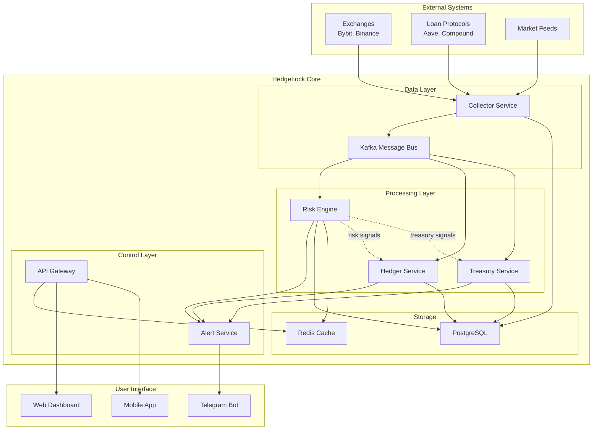
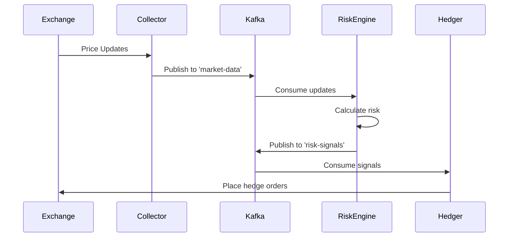
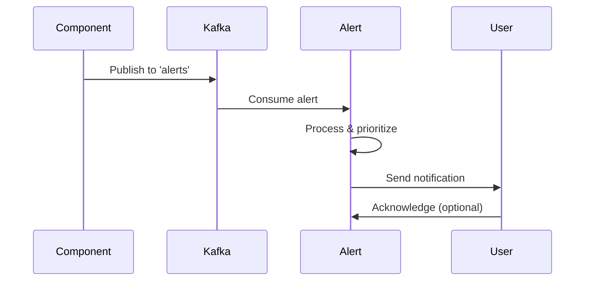

# HedgeLock Product Wiki

## Table of Contents
1. [Overview](#overview)
2. [Key Features](#key-features)
3. [System Architecture](#system-architecture)
4. [Component Overview](#component-overview)
5. [Data Flow](#data-flow)
6. [Glossary](#glossary)
7. [Getting Started](#getting-started)
8. [Team Collaboration](#team-collaboration)

## Overview

HedgeLock is a decentralized loan monitoring and management system with automated liquidation protection. It helps users maintain healthy Loan-to-Value (LTV) ratios for their crypto-backed loans by automatically hedging positions when market conditions threaten liquidation.

### Mission Statement
To provide crypto loan holders with peace of mind through intelligent, automated risk management that prevents liquidations while maximizing capital efficiency.

### Target Users
- DeFi loan holders
- Institutional crypto borrowers
- Risk-conscious traders
- Treasury managers

## Key Features

### 1. Real-time Monitoring
- Continuous tracking of loan positions across multiple protocols
- Live market data integration
- Instant risk assessment

### 2. Automated Hedging
- Dynamic hedge position management
- Multi-exchange execution
- Optimal order routing

### 3. Risk Management
- Configurable LTV thresholds
- Multi-level alert system
- Emergency intervention protocols

### 4. Treasury Operations
- Automated collateral management
- Interest optimization
- Buffer maintenance

## System Architecture



## Component Overview

### 1. Collector Service
**Purpose**: Gathers real-time data from external sources
- Market prices from exchanges
- Account positions and balances
- Loan protocol states
- Gas prices and network conditions

### 2. Risk Engine
**Purpose**: Analyzes positions and calculates risk metrics
- LTV ratio calculations
- Risk scoring
- Hedge requirement determination
- Action prioritization

### 3. Hedger Service
**Purpose**: Executes hedging strategies
- Order placement and management
- Position sizing
- Exchange arbitrage
- Execution optimization

### 4. Treasury Service
**Purpose**: Manages collateral and liquidity
- Collateral deposits/withdrawals
- Interest payment handling
- Buffer management
- Capital allocation

### 5. Alert Service
**Purpose**: Communicates with users
- Multi-channel notifications (Telegram, Email, Webhook)
- Risk level alerts
- Action confirmations
- System status updates

## Data Flow

### 1. Market Data Flow


### 2. Alert Flow


## Glossary

### Financial Terms

**LTV (Loan-to-Value) Ratio**
- The ratio of loan amount to collateral value
- Formula: LTV = (Loan Amount / Collateral Value) × 100%
- Example: $10,000 loan with $20,000 collateral = 50% LTV

**Liquidation Threshold**
- The LTV ratio at which a loan becomes eligible for liquidation
- Varies by protocol (typically 75-85%)
- HedgeLock aims to maintain positions well below this level

**Hedge Position**
- A derivative position that offsets risk in the primary position
- In HedgeLock: Short positions that profit when collateral value drops
- Helps maintain stable LTV ratios

**Collateral Buffer**
- Extra collateral beyond minimum requirements
- Provides safety margin against volatility
- Target buffer: 5-10% above requirements

**Delta Neutral**
- A portfolio state where value doesn't change with small price movements
- Achieved through balanced long/short positions
- Goal for hedged loan positions

### Technical Terms

**Kafka Topics**
- `market-data`: Real-time price feeds
- `account-updates`: Position and balance changes
- `risk-signals`: Risk engine outputs
- `alerts`: System notifications

**Service Mesh**
- Microservices architecture pattern
- Each service runs independently
- Communication via message bus (Kafka)

**Circuit Breaker**
- Safety mechanism to prevent cascading failures
- Temporarily disables operations during issues
- Auto-recovery when conditions improve

**Order Book**
- List of buy/sell orders on an exchange
- Used for optimal order placement
- Analyzed for liquidity and slippage

### System States

**Risk Levels**
- **LOW**: LTV < 40%, no action needed
- **MEDIUM**: LTV 40-50%, monitoring increased
- **HIGH**: LTV 50-60%, hedging activated
- **CRITICAL**: LTV > 60%, emergency measures

**Service States**
- **Healthy**: All systems operational
- **Degraded**: Partial functionality
- **Failed**: Service unavailable
- **Recovering**: Returning to normal

## Getting Started

### Prerequisites
1. Docker and Docker Compose
2. Python 3.11+
3. Node.js 18+ (for dashboard)
4. PostgreSQL 15+
5. Redis 7+

### Quick Start
```bash
# Clone the repository
git clone https://github.com/your-org/hedgelock.git
cd hedgelock

# Copy environment template
cp .env.example .env

# Start services
docker-compose up -d

# Run database migrations
make migrate

# Access dashboard
open http://localhost:3000
```

### Configuration
Key environment variables:
- `LTV_TARGET_RATIO`: Target LTV to maintain (default: 40%)
- `LTV_MAX_RATIO`: Maximum allowed LTV (default: 50%)
- `MAX_ORDER_SIZE_BTC`: Largest single order (default: 10 BTC)
- `MIN_BUFFER_PERCENT`: Minimum collateral buffer (default: 5%)

## Team Collaboration

### Development Workflow
1. **Feature Branches**: Create from `develop`
2. **Pull Requests**: Require 2 approvals
3. **CI/CD**: Automated testing with 90% coverage requirement
4. **Deployment**: Staging → Production pipeline

### Communication Channels
- **Slack**: #hedgelock-dev (daily standups)
- **GitHub**: Issues and PRs
- **Confluence**: Documentation
- **Jira**: Sprint planning

### Access & Permissions
Contact the DevOps team for:
- GitHub repository access
- AWS/GCP credentials
- Monitoring dashboards
- Production logs

### Key Contacts
- **Product Owner**: [Name] (product decisions)
- **Tech Lead**: [Name] (architecture)
- **DevOps**: [Name] (infrastructure)
- **Security**: [Name] (compliance)

---

## Appendix

### Useful Links
- [GitHub Repository](https://github.com/your-org/hedgelock)
- [API Documentation](https://api.hedgelock.io/docs)
- [Monitoring Dashboard](https://monitor.hedgelock.io)
- [Support Portal](https://support.hedgelock.io)

### Version History
- v0.1.2 - Current: Kafka integration, Docker setup
- v0.1.1 - Docker Compose skeleton
- v0.1.0 - Initial release

### License
Copyright © 2024 HedgeLock. All rights reserved.