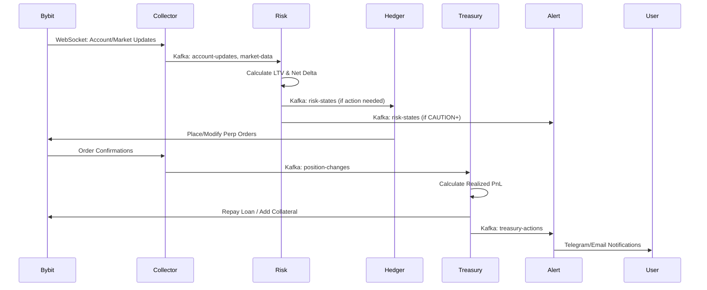

# HedgeLock System Overview

## What is HedgeLock?

HedgeLock is an automated loan safety system that protects cryptocurrency-backed loans from liquidation. When you hold BTC as collateral for a USDT loan on Bybit, market volatility can push your Loan-to-Value (LTV) ratio dangerously high, risking forced liquidation. HedgeLock prevents this by:

• **Monitoring** your loan health in real-time
• **Hedging** with BTCUSDT perpetual futures when BTC price drops
• **Rebalancing** automatically using trading profits
• **Alerting** you when intervention might be needed

The system maintains your LTV at a safe 40% (never exceeding 50%) through intelligent position management. When BTC falls, it opens short perpetual positions to offset losses. When profitable, it uses gains to either repay loan principal or add more collateral, creating a self-reinforcing safety mechanism.

## Module Cheat Sheet

### hedgelock-collector
• **Purpose**: Real-time data ingestion from Bybit
• **Inputs**: Bybit WebSocket feeds (account updates, market data)
• **Outputs**: Kafka topics: `account-updates`, `market-data`, `position-changes`
• **Key Logic**: Deduplication, normalization, heartbeat monitoring

### hedgelock-risk
• **Purpose**: Risk calculation and state management
• **Inputs**: Kafka: `account-updates`, `market-data`
• **Outputs**: Kafka: `risk-states` (SAFE/CAUTION/DANGER/CRITICAL)
• **Key Logic**: 
  - LTV = (Loan Amount / Collateral Value) × 100
  - Net Delta = BTC Spot - BTC Perp Short
  - Trigger thresholds: 40% (target), 45% (caution), 48% (danger), 50% (critical)

### hedgelock-hedger
• **Purpose**: Execute hedging trades based on risk signals
• **Inputs**: Kafka: `risk-states`
• **Outputs**: Bybit orders, Kafka: `hedge-executions`
• **Key Logic**:
  - Size = Net Delta × Risk Multiplier
  - Use limit orders with 10bps spread
  - Cancel/replace if not filled within 30s

### hedgelock-treasury
• **Purpose**: Allocate realized PnL for loan management
• **Inputs**: Kafka: `hedge-executions`, `position-changes`
• **Outputs**: Bybit loan operations, Kafka: `treasury-actions`
• **Key Logic**:
  - If LTV > 45%: Use profits to add collateral
  - If LTV < 35%: Use profits to repay principal
  - Keep 5% buffer for fees

### hedgelock-alert
• **Purpose**: Multi-channel notifications for risk events
• **Inputs**: Kafka: `risk-states`, `treasury-actions`
• **Outputs**: Telegram messages, emails
• **Key Logic**: Rate limiting, severity-based routing, action summaries

## System Flow Diagram

